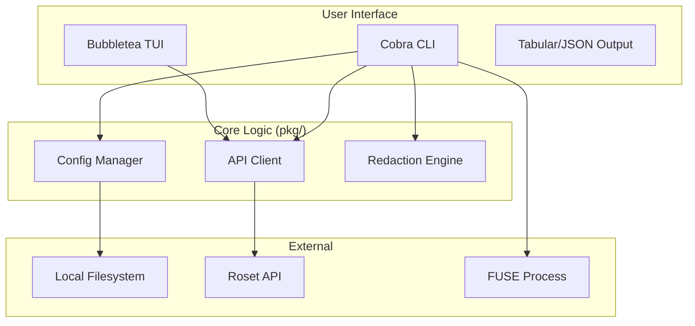

# Roset CLI Architecture

> Design principles and implementation details for the Roset command-line interface

## Overview

The Roset CLI (`roset`) is the primary administrative and operational interface for the Roset platform. It provides commands for authentication, system status monitoring, filesystem management, and diagnostic collection.

Designed for:
- **Automation**: Universal `--json` output support for pipe-friendly operations.
- **Safety**: Automated secret redaction for support bundles and hardened configuration permissions.
- **Human-Centric UX**: Rich terminal UI (TUI) components for interactive tasks like authentication.

---

## Technical Stack

The CLI is built with Go, leveraging modern libraries for a robust terminal experience:

| Category | Library | Purpose |
|----------|---------|---------|
| **Core** | `spf13/cobra` | CLI command structure and flag parsing |
| **Config** | `spf13/viper` | Configuration management and environment overrides |
| **TUI** | `charmbracelet/bubbletea` | Interactive terminal flows (The Elm Architecture) |
| **Styling** | `charmbracelet/lipgloss` | Terminal styling and layout |
| **Diagnostics**| Internal `pkg/redact` | Regex-based sensitive data masking |

---

## Core Components

### 1. Command Layer (`cmd/`)

The entry point for all operations. Commands follow a hierarchical structure:
- `root.go`: Initializes the CLI, defines global flags (`--json`, `--api-key`), and sets up Viper.
- `login.go` / `logout.go`: Handles credential persistence using an interactive TUI for login.
- `status.go`: Performs health checks and connectivity diagnostics.
- `mount.go` / `unmount.go`: Manages the lifecycle of FUSE processes.
- `debug.go`: Orchestrates diagnostic collection.

### 2. Configuration Manager (`pkg/config/`)

Handles durable state and environment configuration:
- **Persistence**: Configuration is stored in `~/.roset/config.yaml`.
- **Security**: Files are created with `0640` or `0600` permissions (hardened during `Save`).
- **Overrides**: Environment variables prefixed with `ROSET_` (e.g., `ROSET_API_KEY`) automatically override file-based config.

### 3. API Client (`pkg/api/`)

A minimalist wrapper around the Standard Library's `http.Client`:
- **Timeout Implementation**: Default 30s timeout for all operations.
- **Error Handling**: Maps HTTP status codes to typed Go errors with codes (e.g., `UNAUTHORIZED`).
- **Instrumentation**: Captures request latency for inclusion in `status` and `debug` outputs.

### 4. Redaction Engine (`pkg/redact/`)

A safety-first component used primarily by `debug bundle`:
- **Regex Patterns**: Pre-defined patterns for Roset keys (`ros_...`), AWS credentials, DB URLs, and JWTs.
- **Context Awareness**: Pattern matching for key-value pairs in various formats (YAML, JSON, Env).
- **Redaction Policy**: Secrets are replaced with descriptive placeholders (e.g., `REDACTED_ROSET_KEY`).

---

## Operational Flows

### Diagnostic Collection (`debug bundle`)

When a user runs `roset debug bundle`, the following sequence occurs:
1. **System Discovery**: Collects OS info, FUSE mount lists, and kernel logs.
2. **Connectivity Check**: Records API latency and DNS resolution status.
3. **Log Aggregation**: Reads application logs from standard locations.
4. **Redaction**: Every line of collected text is passed through `pkg/redact` before being written to the archive.
5. **Compression**: Resulting data is saved as a `.tar.gz` bundle.

### Interactive Login

The login flow utilizes **The Elm Architecture (TEA)** via Bubbletea:
1. **Model**: State tracking (key input, validation status, error messages).
2. **Update**: Handles keystrokes and triggers asynchronous API calls for key validation.
3. **View**: Renders a clean, styled form with immediate feedback on key validity.

---

## Security Model

### Credential Handling
- **Memory Safety**: API keys are cleared after use where possible.
- **Process args**: Commands like `mount` pass credentials via temporary files or environment variables to avoid exposure in process lists.
- **Hardened Permissions**: The CLI enforces strict owner-only access to its configuration directory.

### Diagnostic Privacy
The `debug bundle` command is "redact-by-default":
- Cloud provider keys (AWS, Azure, GCP) are automatically masked.
- Database connection strings are sanitized.
- Personal identifiers in logs are targeted for removal.

---

## Configuration Reference

| Flag | Env Var | Default | Description |
|------|---------|---------|-------------|
| `--api-key` | `ROSET_API_KEY` | - | API key for authentication |
| `--api-url` | `ROSET_API_URL` | `https://api.roset.dev` | Target Roset API endpoint |
| `--config` | - | `~/.roset/config.yaml` | Path to configuration file |
| `--json` | - | `false` | Enable structured JSON output |

---

## Roadmap

### P0: Essential
- [ ] **Unified Error Handling**: Standardize error JSON structure across all commands.
- [ ] **Update Notifier**: Alert users when a newer version of the CLI is available.

### P1: Performance & UX
- [ ] **Profile Support**: Allow switching between multiple named configurations (e.g., `prod`, `staging`).
- [ ] **Telemetry (Opt-in)**: Privacy-preserving command usage metrics.

### P2: Advanced Features
- [ ] **Plugin System**: Enable community extensions for specialized workflows.
- [ ] **Interactive Shell**: A persistent sub-shell for high-frequency operations.
