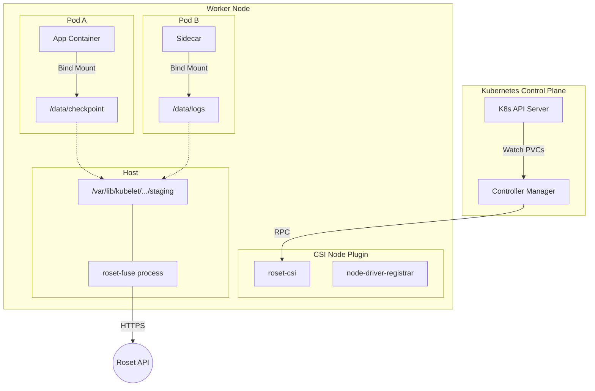
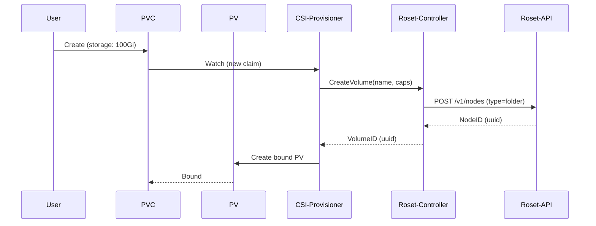
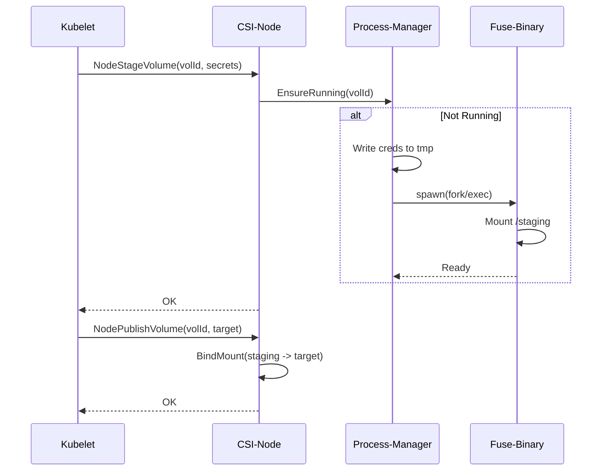

# Roset CSI Driver Architecture

> Implementation specification for the Roset Container Storage Interface (CSI) driver

## Overview

The Roset CSI driver (`roset-csi`) enables Kubernetes workloads to consume Roset storage natively. It implements the CSI v1.x specification, orchestrating the `roset-fuse` client to provide high-performance, shared POSIX access to distributed datasets.

Designed for:
- **Scalability**: Shared FUSE mounts per node (reducing connection overhead)
- **Security**: Secure credential passing without leaking secrets in process args
- **Immutability**: First-class support for restoration from ML model checkpoints

---

## Core Components

The driver is essentially a gRPC server implementing three CSI services.

### 1. Identity Service

**Responsibility**: Plugin registration and health verify.

- **`GetPluginInfo`**: Returns `io.roset.csi` and version.
- **`GetPluginCapabilities`**: Announces `CONTROLLER_SERVICE` and `VOLUME_ACCESSIBILITY_CONSTRAINTS`.
- **`Probe`**: Checks readiness (verifies `roset-fuse` binary presence and API connectivity).

### 2. Controller Service

**Responsibility**: Cluster-level volume management (Provisioning).

| RPC | Action | Semantics |
|-----|--------|-----------|
| `CreateVolume` | Allocates new Node/Folder | Creates a new directory/node in Roset via API. returns `volumeId`. |
| `DeleteVolume` | Soft-deletes Node | Marks node as deleted. |
| `ValidateVolumeCapabilities` | Checks access mode | Enforces `ReadWriteMany` / `ReadOnlyMany`. |
| `CreateSnapshot` | Creates Commit | Triggers a Roset commit/snapshot of the target folder. |
| `RestoreSnapshot` | Clones from Commit | Creates a new volume initialized from a commit hash. |

> [!NOTE]
> Roset is a shared filesystem. `CreateVolume` roughly maps to `transport.CreateDirectory(name)`. The volume ID is the Roset `NodeID`.

### 3. Node Service

**Responsibility**: Local mount management.

This is the most complex component, handling the FUSE process lifecycle.

#### `NodeStageVolume` (The "Global Mount")
Executed **once per node** for a given Volume.
1. Checks if `roset-fuse` is already running for this `volumeId`.
2. If not, fetches credentials from `NodeStageVolumeRequest.Secrets`.
3. Writes credentials to a secure temp file (avoiding CLI args).
4. Spawns `roset-fuse` detached process mounted at `staging_target_path`.
5. Waits for mount readiness.

#### `NodePublishVolume` (The "Pod Bind")
Executed **for each pod** using the volume.
1. Identifies the `staging_target_path`.
2. Performs a read-only or read-write **bind mount** from Staging → Pod Target.
3. Supports `volume_mount.subpath` (mounting a subdirectory of the bucket).

#### `NodeUnpublishVolume`
1. Unmounts the bind mount.

#### `NodeUnstageVolume`
Executed when the last pod leaves the node.
1. Checks reference count.
2. Sends `SIGTERM` to `roset-fuse`.
3. Cleans up staging directories and secret files.

---

## Volume Lifecycle

### Provisioning Flow (`StorageClass` based)

### Mounting Flow (Pod Startup)

---

## Reliability & Recovery

### Process Management
The CSI Node plugin acts as a supervisor for `roset-fuse` processes.
- **Monitoring**: It does *not* actively restart crashed FUSE processes (Kubernetes doesn't support this well). Instead, relies on the app crashing (IO Error) and Kubelet retrying `NodePublish`/`NodeStage`.
- **Orphan Cleanup**: On startup, the CSI driver scans `/var/lib/kubelet/plugins/io.roset.csi/mounts` and kills any orphan FUSE processes not tracked by Kubernetes.

### Error Handling

| Error Scenario | CSI Response | Result |
|----------------|--------------|--------|
| API Key Invalid | `NodeStage` fails with `Unauthenticated` | Pod stays `ContainerCreating`, Kubelet retries |
| Mount Hangs | `NodeStage` timeouts (default 2m) | Kubelet retries with backoff |
| Stale File Handle | `NodePublish` checks mount validity | Returns `Internal` error, forces pod restart |
| Node Hard Reboot | FUSE process gone | New `NodeStage` creates fresh mount |

---

## Configuration

The driver is configured via CLI args on the `roset-csi` container, usually passed via Helm values.

| Flag | Default | Description |
|------|---------|-------------|
| `--endpoint` | `unix:///csi/csi.sock` | CSI gRPC socket path |
| `--node-id` | (k8s node name) | Unique node identifier |
| `--fuse-image` | `roset-fuse:latest` | Image/binary to use for mounts |
| `--mount-dir` | `/var/lib/roset/mounts` | Directory to store active sockets/pids |

---

## Security Model

### Secret Handling
Secrets (API Keys) are critical and must not leak.
1. **Source**: Kubernetes `Secret` referenced in `StorageClass` or `PVC`.
2. **Transportation**: Passed via `NodeStageVolume` gRPC "Secrets" map.
3. **Usage**:
   - CSI Driver writes key to a `tmpfs` or `0600` root-owned file in the driver pod.
   - Passes path to `roset-fuse` via env var `ROSET_CREDENTIALS_FILE`.
   - **NEVER** passed as command-line argument (visible in `ps aux`).

### Permissions
- **Driver Pod**: Requires `privileged: true` and `Bidirectional` mount propagation to inject mounts into host namespace.
- **FUSE Process**: Runs as root (typically required for FUSE allow_other) but can be configured to drop caps.

---

## Deployment Topologies

### 1. DaemonSet (Standard)
- **Components**: Node Plugin + Driver Registrar
- **Scope**: Runs on every node.
- **Pros**: Local access, simple scaling.
- **Cons**: higher resource reservation per node.

### 2. Sidecar (Controller)
- **Components**: Controller Plugin + External Provisioner + External Attacher
- **Scope**: StatefulSet (singleton/HA).
- **Responsibility**: Creation/Deletion of "Volumes" (Folders) and Snapshots.

---

## Roadmap

### P0: Core Stability
- [ ] **Liveness Probe**: Implement real logic in `Probe()` to check if Roset API is reachable.
- [ ] **Stale Mount Cleanup**: Robust detection of "dead" FUSE mounts on node startup.

### P1: Performance
- [ ] **Shared Cache**: Allow multiple FUSE mounts on the same node to share a local disk cache (requires `roset-fuse` support).
- [ ] **Topology Awareness**: Prefer usage of volumes in the same cloud zone/region.

### P2: Advanced Features
- [ ] **Volume Expansion**: Implement `ControllerExpandVolume` to update quota/limits.
- [ ] **Ephemeral Volumes**: Support CSI ephemeral inline volumes for scratch pads.
