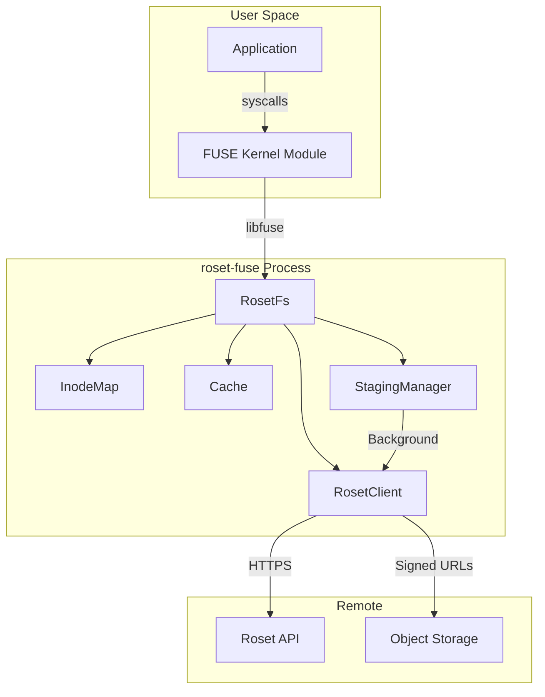
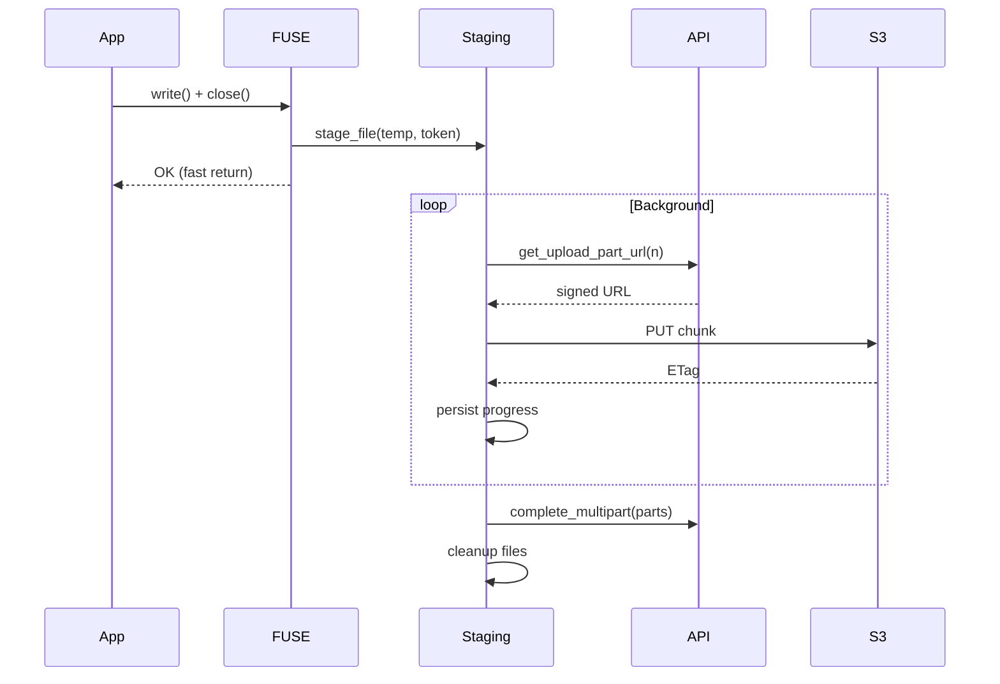
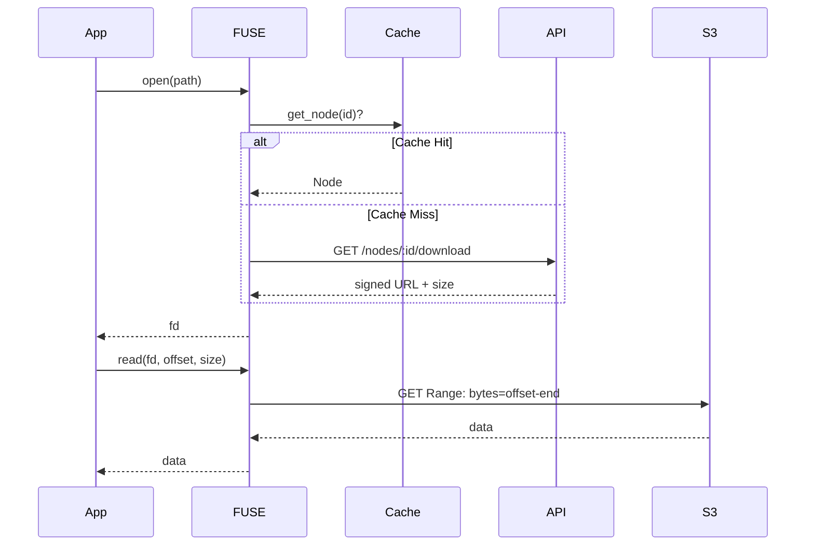
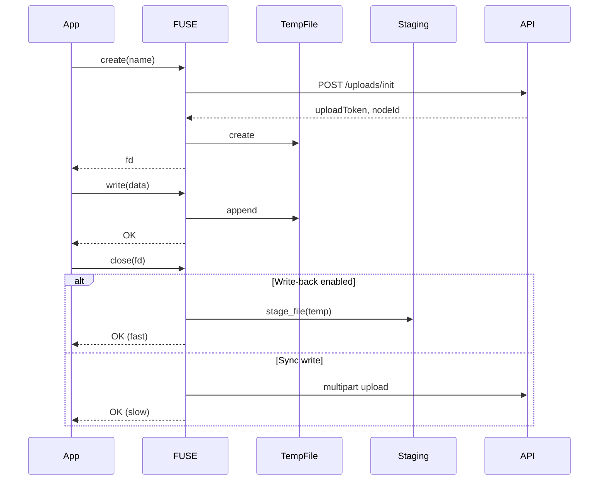

# FUSE Client Architecture

> Design principles and implementation details for the Roset FUSE filesystem client

## Overview

The FUSE client allows mounting Roset-managed object storage as a local POSIX-compatible filesystem. Optimized for ML workloads with intelligent caching, atomic checkpoints, and high-throughput parallel uploads.



---

## Core Components

### 1. RosetFs (`fs.rs`)

The main FUSE filesystem implementation. Implements `fuser::Filesystem` trait with 30+ POSIX operations:

| Operation | Description |
|-----------|-------------|
| `lookup` | Resolve name in directory |
| `getattr` | Get file/folder attributes |
| `readdir` | List directory contents |
| `open` / `read` | Read file data |
| `create` / `write` / `release` | Create and write files |
| `mkdir` / `rmdir` / `unlink` | Directory and file deletion |
| `rename` | Move/rename (O(1) metadata op) |
| `setattr` | Truncate, update timestamps |

**Key Design Decisions:**

```rust
pub struct RosetFs {
    client: Arc<RosetClient>,      // API client
    inodes: InodeMap,              // UUID ↔ inode mapping
    cache: Cache,                  // Metadata + directory cache
    rt: Runtime,                   // Tokio runtime for async
    handles: Mutex<HashMap<...>>,  // Open file handles
    staging_manager: Option<...>,  // Background uploads
    read_only: bool,               // Read-only mode flag
}
```

> [!NOTE]
> FUSE callbacks are synchronous, so we use `rt.block_on()` to bridge to async API calls. Each operation completes within a single blocking call.

---

### 2. InodeMap (`inode.rs`)

Maps Roset UUIDs to 64-bit FUSE inodes:

```rust
pub struct InodeMap {
    next_ino: AtomicU64,              // Counter (starts at 2)
    node_to_ino: RwLock<HashMap<...>>, // UUID → inode
    ino_to_node: RwLock<HashMap<...>>, // inode → UUID
    refcounts: RwLock<HashMap<...>>,   // Inode refcounts
}
```

**Rules:**
- Root inode is always `1` (FUSE convention)
- Inodes are allocated lazily on first access
- Reference counting for `forget()` callback cleanup

---

### 3. Cache (`cache.rs`)

LRU cache with TTL for metadata and directory listings:

| Cache | Purpose | Size | Policy |
|-------|---------|------|--------|
| `nodes` | Node metadata | 10,000 | Mutable (TTL) or Immutable |
| `children` | Directory listings | 1,000 | Mutable (TTL) or Immutable |
| `parents` | Reverse lookups | 10,000 | No expiry |

**Cache Policies:**

```rust
pub enum CachePolicy {
    Mutable(Duration),  // Expires after TTL
    Immutable,          // Never expires (committed snapshots)
}
```

> [!TIP]
> **Committed directories** (ML checkpoints) are cached as `Immutable` — they never change, so no TTL is needed.

---

### 4. RosetClient (`client.rs`)

HTTP client for Roset API with typed errors:

```rust
pub enum ApiError {
    NotFound,           // → ENOENT
    Unauthorized,       // → EACCES
    Forbidden,          // → EACCES
    LeaseConflict,      // → EBUSY
    RateLimited,        // → EAGAIN
    ServerError(String),
    NetworkError(...),
}
```

**API Endpoints Used:**

| Endpoint | Purpose |
|----------|---------|
| `POST /v1/resolve` | Path → Node lookup |
| `GET /v1/nodes/:id` | Get node by ID |
| `GET /v1/nodes/:id/children` | List children |
| `GET /v1/nodes/:id/download` | Get signed download URL |
| `GET /v1/nodes/:id/manifest` | Get immutable manifest |
| `POST /v1/nodes` | Create file/folder |
| `PATCH /v1/nodes/:id` | Rename/move |
| `DELETE /v1/nodes/:id` | Soft delete |
| `POST /v1/uploads/init` | Start upload |
| `POST /v1/uploads/:token/part` | Get part URL |
| `POST /v1/uploads/:token/complete` | Finalize multipart |

---

### 5. StagingManager (`staging.rs`)

Background multipart upload with crash recovery:



**Crash Recovery:**
1. Job metadata saved to `.job.json` files
2. On startup, scan staging directory for incomplete jobs
3. Resume uploads from last completed part
4. Failed jobs moved to `staging/failed/` (dead letter queue)

**Tuning:**

| Parameter | Default | Description |
|-----------|---------|-------------|
| `PART_SIZE` | 20 MB | Chunk size for multipart |
| `CONCURRENCY` | 5 | Parallel part uploads |
| `max_attempts` | 5 | Retries per job |

---

## Configuration (`config.rs`)

CLI powered by `clap` with env fallbacks:

```bash
roset-fuse /mnt/data \
  --api-key rk_... \
  --mount-id mount_abc \
  --cache-ttl 300 \
  --cache-size-mb 256 \
  --write-back-cache \
  --allow-other \
  --read-only
```

| Flag | Env Var | Default | Description |
|------|---------|---------|-------------|
| `--api-key` | `ROSET_API_KEY` | required | API key |
| `--mount-id` | `ROSET_MOUNT_ID` | default | Storage mount |
| `--cache-ttl` | — | 300s | Metadata cache TTL |
| `--cache-size-mb` | — | 256 | Read cache size |
| `--write-back-cache` | — | off | Enable background uploads |
| `--staging-dir` | `ROSET_STAGING_DIR` | `.roset/staging` | Staging path |
| `--allow-other` | — | off | Allow other users |
| `--read-only` | — | off | Read-only mount |

---

## Read Path



**Optimizations:**
- Signed URLs cached in file handle (avoid per-read API call)
- Range requests for partial reads
- Retry with exponential backoff on transient errors

---

## Write Path



**Write-back caching:**
- Writes go to temp file, not directly to API
- On `close()`, file is moved to staging queue
- Background worker uploads in parallel
- App sees fast close, durability is eventual

> [!CAUTION]
> With `--write-back-cache`, data loss is possible if the machine crashes before upload completes. The staging directory should be on a persistent filesystem.

---

## Error Mapping

API errors are mapped to POSIX errno:

| API Error | errno | Meaning |
|-----------|-------|---------|
| `NotFound` | `ENOENT` | No such file |
| `Unauthorized` | `EACCES` | Permission denied |
| `Forbidden` | `EACCES` | Permission denied |
| `LeaseConflict` | `EBUSY` | Resource busy |
| `RateLimited` | `EAGAIN` | Try again |
| `ServerError` | `EIO` | I/O error |
| `NetworkError` | `EIO` | I/O error |

---

## Dependencies

```toml
[dependencies]
fuser = "0.14"           # FUSE bindings
tokio = { version = "1", features = ["full"] }
reqwest = { version = "0.11", features = ["json", "rustls-tls", "stream"] }
clap = { version = "4", features = ["derive", "env"] }
lru = "0.12"             # LRU cache
parking_lot = "0.12"     # Fast synchronization
tracing = "0.1"          # Structured logging
anyhow = "1"             # Error handling
thiserror = "1"          # Error derive
tempfile = "3"           # Temp files for writes
```

---

## File Structure

```
fuse/
├── Cargo.toml
├── README.md
└── src/
    ├── main.rs      # Entry point, signal handling
    ├── config.rs    # CLI parsing (clap)
    ├── fs.rs        # FUSE operations (fuser::Filesystem)
    ├── client.rs    # Roset API client
    ├── cache.rs     # LRU metadata cache
    ├── inode.rs     # UUID ↔ inode mapping
    └── staging.rs   # Background upload worker
```

---

## Platform Support

| Platform | Status |
|----------|--------|
| Linux | ✅ Full support |
| macOS | ✅ Via macFUSE |
| Windows | ❌ Not supported (no FUSE) |

---

## Future Improvements

1. **Read-ahead buffer** — Prefetch next chunks for sequential reads
2. **Negative lookup cache** — Cache "file not found" to avoid repeated API calls
3. **Lease integration** — Acquire leases before writes for conflict prevention
4. **Kernel page cache** — Enable `direct_io` opt-out for better performance
5. **Extended attributes** — Map `metadata` field to xattr
