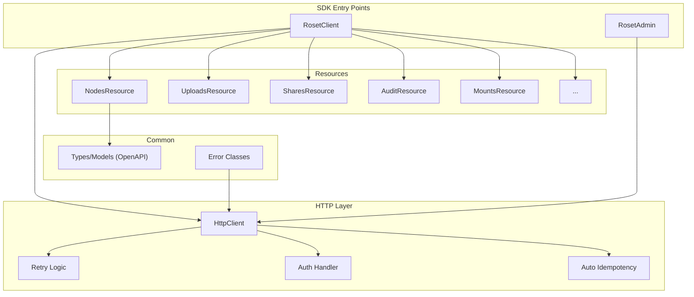

# SDK Architecture

> Design principles and best practices for the Roset SDK (TypeScript & Python)

## Overview

The SDK provides a unified interface for interacting with the Roset API, supporting both server-side and browser environments. It follows a **resource-based architecture** with a focus on type safety, error handling, and developer experience.



---

## Core Design Principles

### 1. Resource-Based Architecture

Each API domain is encapsulated in its own resource class:

```typescript
// TypeScript
class RosetClient {
  public readonly nodes: NodesResource;
  public readonly uploads: UploadsResource;
  public readonly shares: SharesResource;
  // ...
}

// Usage
const folder = await client.nodes.createFolder("my-folder");
const url = await client.uploads.getDownloadUrl(file.id);
```

```python
# Python (async-first)
class RosetClient:
    async def __init__(self, api_key: str):
        self.nodes = NodesResource(self._http)
        self.uploads = UploadsResource(self._http)
        self.shares = SharesResource(self._http)

# Usage
folder = await client.nodes.create_folder("my-folder")
url = await client.uploads.get_download_url(file.id)
```

**Benefits:**
- Clear separation of concerns
- Discoverable API via autocomplete
- Easy to add new resources without modifying core

---

### 2. Flexible Authentication

Support multiple authentication strategies:

| Strategy | Use Case | Allowed Clients |
|----------|----------|-----------------|
| `apiKey` | Server-side, long-lived tokens | `RosetClient`, `RosetAdmin` |
| `getAccessToken()` | Browser, rotating JWT tokens | `RosetClient` only |

```typescript
// Static API key (server-side)
const client = new RosetClient({ apiKey: process.env.ROSET_API_KEY });

// Dynamic token (browser with auth provider)
const client = new RosetClient({
  getAccessToken: async () => await clerk.getToken(),
});
```

> [!IMPORTANT]
> Exactly one authentication method must be provided. The SDK validates this at construction time.

> [!WARNING]
> `RosetAdmin` requires a static `apiKey` and will throw if constructed with `getAccessToken`. This prevents accidental admin operations from browser contexts.

---

### 3. Error Hierarchy

Use typed error classes for predictable error handling:

```typescript
// Base error with comprehensive debugging info
class RosetError extends Error {
  code: string;
  statusCode: number;
  details?: Record<string, unknown>;
  
  // Debugging & support
  requestId?: string;     // From X-Request-Id header
  retryable: boolean;     // Computed by HTTP client
  cause?: unknown;        // Original error (network, etc.)
}

// Specific error types
class NotFoundError extends RosetError {}
class ForbiddenError extends RosetError {}
class RateLimitError extends RosetError { retryAfter?: number }
class QuotaExceededError extends RosetError {}
class ValidationError extends RosetError {}
```

**Usage Pattern:**

```typescript
try {
  await client.nodes.get(nodeId);
} catch (error) {
  if (error instanceof NotFoundError) {
    // Handle 404
  } else if (error instanceof RateLimitError) {
    await sleep(error.retryAfter ?? 1000);
    // Retry
  } else if (error instanceof RosetError) {
    // Log for support
    console.error(`Request ${error.requestId} failed: ${error.message}`);
    if (error.retryable) {
      // Safe to retry
    }
  }
}
```

---

### 4. Automatic Retry with Backoff

The HTTP client handles transient failures automatically:

| Condition | Retry Behavior |
|-----------|----------------|
| Rate limit (429) | Retry with `Retry-After` header or exponential backoff |
| Server errors (5xx) | Retry only for safe/idempotent requests |
| Network errors | Retry only for safe/idempotent requests |

**Retry Safety Rules:**

| Method | Retry Policy |
|--------|--------------|
| `GET`, `HEAD`, `OPTIONS` | Always safe to retry |
| `DELETE` | Retry only with idempotency key (see note) |
| `POST`, `PUT`, `PATCH` | Retry only with idempotency key |

> [!NOTE]
> **DELETE is NOT auto-retried** without an idempotency key. While DELETE is often idempotent, operations like "revoke share" or "delete API key" may produce confusing "already deleted" errors on retry. Requiring explicit idempotency makes retry behavior predictable.

---

### 5. Automatic Idempotency Keys

The HTTP layer **auto-generates idempotency keys** for all mutating requests (`POST`, `PUT`, `PATCH`, `DELETE`):

```typescript
// HTTP client internally:
if (isMutatingMethod(method) && !options?.idempotencyKey) {
  headers["Idempotency-Key"] = generateIdempotencyKey();
}
```

**Behavior:**
- Auto-generated keys enable safe retries by default
- Users can provide explicit keys for cross-request deduplication
- The used key is exposed in response metadata

```typescript
// Explicit key for deduplication across requests
const key = RosetClient.generateIdempotencyKey();
await client.nodes.create("folder", "folder", { idempotencyKey: key });

// Or let the SDK auto-generate (safe retries within single call)
await client.nodes.create("folder", "folder");  // Still retryable!
```

> [!TIP]
> To **disable** auto-idempotency for a specific call (rare), pass `idempotencyKey: null`.

---

### 6. Mount Scoping

Support multi-mount architectures with flexible scoping:

```typescript
// Default mount from config
const client = new RosetClient({ apiKey, mountId: "default-mount" });

// Create mount-scoped client (new instance)
const s3Client = client.useMount("mount-s3-prod");
const gcsClient = client.useMount("mount-gcs-backup");

// Scoped operations
await s3Client.nodes.list("/");  // Lists from S3 mount
await gcsClient.nodes.list("/"); // Lists from GCS mount
```

**Per-request mount override** (avoids client proliferation):

```typescript
// Override mount for a single operation
await client.nodes.list("/", { mount: "mount-gcs-backup" });

// Or use .with() for multiple operations
const result = await client.with({ mount: "mount-gcs-backup" }).nodes.list("/");
```

```typescript
// RequestOptions now includes mount override
interface RequestOptions {
  timeout?: number;
  idempotencyKey?: string | null;
  signal?: AbortSignal;
  headers?: Record<string, string>;
  mount?: string;  // Per-request mount override
}
```

---

## Python SDK: Async-First Design

The Python SDK follows an **async-first** architecture:

```python
# Primary: Async client (recommended)
from roset import AsyncRosetClient

async with AsyncRosetClient(api_key="...") as client:
    folder = await client.nodes.create_folder("my-folder")
    async for node in client.nodes.list_all("/"):
        print(node.name)

# Alternative: Sync wrapper (for scripts, notebooks)
from roset import RosetClient  # Sync facade

with RosetClient(api_key="...") as client:
    folder = client.nodes.create_folder("my-folder")
    for node in client.nodes.list_all("/"):
        print(node.name)
```

**Design rationale:**
- ML workflows often involve async I/O (checkpointing during training)
- `httpx` is async-native with excellent performance
- Sync wrapper uses `asyncio.run()` internally for convenience

---

## Admin Client Capabilities

`RosetAdmin` provides tenant/org management and enforces stricter security:

```typescript
// Admin client - requires static API key
const admin = new RosetAdmin({ apiKey: process.env.ROSET_ADMIN_KEY });

// Throws: "RosetAdmin requires apiKey, not getAccessToken"
const admin = new RosetAdmin({ getAccessToken: () => "..." }); // ❌ Error
```

**Capability enforcement:**

| Capability | `RosetClient` | `RosetAdmin` |
|------------|---------------|--------------|
| File operations | ✅ | ❌ |
| Uploads/downloads | ✅ | ❌ |
| Tenant management | ❌ | ✅ |
| API key management | ❌ | ✅ |
| Billing/usage | Read-only | Full access |

> [!CAUTION]
> Never expose `RosetAdmin` credentials to browser environments. The SDK will warn if `getAccessToken` is attempted on `RosetAdmin`.

---

## File Structure

### TypeScript SDK

```
typescript/
├── src/
│   ├── index.ts           # Public exports
│   ├── client.ts          # RosetClient (main entry)
│   ├── admin.ts           # RosetAdmin (tenant management)
│   ├── http.ts            # HttpClient (request/retry/idempotency)
│   ├── errors.ts          # Error class hierarchy
│   ├── types.ts           # TypeScript interfaces
│   ├── generated/         # OpenAPI-generated types (DO NOT EDIT)
│   │   └── models.ts
│   └── resources/
│       ├── nodes.ts       # File/folder operations
│       ├── uploads.ts     # Upload/download
│       ├── shares.ts      # Share links
│       ├── mounts.ts      # Storage backends
│       ├── audit.ts       # Audit logs
│       ├── commits.ts     # ML checkpoints
│       ├── refs.ts        # Symbolic references
│       ├── search.ts      # Discovery
│       ├── user.ts        # User profile
│       ├── billing.ts     # Usage/quotas
│       └── ...
├── package.json
└── tsconfig.json
```

### Python SDK

```
python/
├── src/roset/
│   ├── __init__.py        # Public exports
│   ├── client.py          # AsyncRosetClient + RosetClient (sync)
│   ├── admin.py           # AsyncRosetAdmin + RosetAdmin (sync)
│   ├── http_client.py     # Async HTTP with retries
│   ├── exceptions.py      # Exception classes
│   ├── models.py          # Pydantic models
│   ├── generated/         # OpenAPI-generated models (DO NOT EDIT)
│   │   └── models.py
│   ├── resources/
│   │   ├── nodes.py
│   │   ├── uploads.py
│   │   ├── shares.py
│   │   └── ...
│   └── integrations/      # Framework integrations
│       ├── pytorch.py     # PyTorch checkpointing
│       ├── huggingface.py # HF Hub integration
│       └── ray.py         # Ray checkpoint support
├── tests/
└── pyproject.toml
```

---

## Type Generation from OpenAPI

Models are **generated from OpenAPI spec** to prevent drift:

```bash
# Generate types from API spec
pnpm run generate:types   # TypeScript
make generate-types       # Python
```

**What's generated:**
- Request/response body types
- Enum definitions
- Shared models (`Node`, `Mount`, `Commit`, etc.)

**What's hand-written:**
- Resource classes (business logic)
- Error classes (SDK-specific)
- Client configuration types

> [!TIP]
> Run type generation in CI to catch API/SDK drift early.

---

## Auto-Pagination Helpers

Both SDKs provide async iterators for paginated endpoints:

### TypeScript

```typescript
// Manual pagination
const page1 = await client.nodes.list("/", { page: 1, pageSize: 50 });
const page2 = await client.nodes.list("/", { page: 2, pageSize: 50 });

// Auto-pagination (recommended)
for await (const node of client.nodes.listAll("/")) {
  console.log(node.name);
}

// Collect all into array
const allNodes = await client.nodes.listAll("/").toArray();
```

### Python

```python
# Manual pagination
page1 = await client.nodes.list("/", page=1, page_size=50)
page2 = await client.nodes.list("/", page=2, page_size=50)

# Auto-pagination (recommended)
async for node in client.nodes.list_all("/"):
    print(node.name)

# Collect all into list
all_nodes = [node async for node in client.nodes.list_all("/")]
```

**Implementation:**

```typescript
class PaginatedIterator<T> implements AsyncIterable<T> {
  async *[Symbol.asyncIterator]() {
    let page = 1;
    while (true) {
      const result = await this.fetchPage(page);
      for (const item of result.items) yield item;
      if (!result.hasMore) break;
      page++;
    }
  }
  
  async toArray(): Promise<T[]> {
    const items: T[] = [];
    for await (const item of this) items.push(item);
    return items;
  }
}
```

---

## Best Practices

### Type Safety

```typescript
// ✅ Use explicit return types
async get(id: string): Promise<NodeWithVersion> { ... }

// ✅ Use branded types for IDs (optional but recommended)
type NodeId = string & { readonly brand: unique symbol };

// ✅ Discriminated unions for polymorphic types
type NodeType = "file" | "folder";
interface Node {
  type: NodeType;
  size: number; // Only meaningful for files
}
```

### Request Options Pattern

Every method accepts optional `RequestOptions`:

```typescript
interface RequestOptions {
  timeout?: number;
  idempotencyKey?: string | null;  // null = disable auto-generation
  signal?: AbortSignal;
  headers?: Record<string, string>;
  mount?: string;  // Per-request mount override
}

// Intersection pattern for resource-specific options
async create(
  name: string,
  type: NodeType,
  options?: CreateNodeOptions & RequestOptions
): Promise<Node>
```

### Pagination

Use consistent `PaginatedResult<T>` pattern:

```typescript
interface PaginatedResult<T> {
  items: T[];
  total: number;
  page: number;
  pageSize: number;
  hasMore: boolean;
}
```

### Convenience Methods

Provide both low-level and high-level APIs:

```typescript
class NodesResource {
  // Low-level: full control
  async update(id: string, updates: UpdateNodeOptions): Promise<Node>
  
  // High-level: common operations
  async rename(id: string, newName: string): Promise<Node> {
    return this.update(id, { name: newName });
  }
  
  async move(id: string, newParentId: string): Promise<Node> {
    return this.update(id, { parentId: newParentId });
  }
}
```

---

## Testing Strategy

### Unit Tests

- Mock `HttpClient` for resource testing
- Test error parsing and retry logic
- Test idempotency key generation

### Integration Tests

- Use test tenants with isolated mounts
- Test full request/response cycles
- Verify `requestId` propagation

### E2E Tests

- Test authentication flows
- Test upload/download with real storage
- Test auto-pagination across large datasets

---

## Versioning & Compatibility

| SDK Version | API Version | Status |
|-------------|-------------|--------|
| 0.x.x | v1 | Development |
| 1.x.x | v1 | Stable |

**Breaking Change Policy:**
- Major version bump for breaking changes
- Deprecation warnings in minor versions
- At least 2 minor versions before removal

---

## Environment Support

### TypeScript
- Node.js 18+
- Modern browsers (ES2020+)
- Cloudflare Workers, Deno, Bun

### Python
- Python 3.9+
- `httpx` for async HTTP
- `pydantic` for models

---

## Security Considerations

1. **Never log API keys** — mask in debug output
2. **Validate callback returns** — `getAccessToken` may return null
3. **Timeout all requests** — prevent hung connections
4. **Abort signal support** — allow request cancellation
5. **Admin isolation** — `RosetAdmin` rejects browser auth patterns

```typescript
// Request cancellation
const controller = new AbortController();
setTimeout(() => controller.abort(), 5000);

await client.nodes.list("/", { signal: controller.signal });
```
